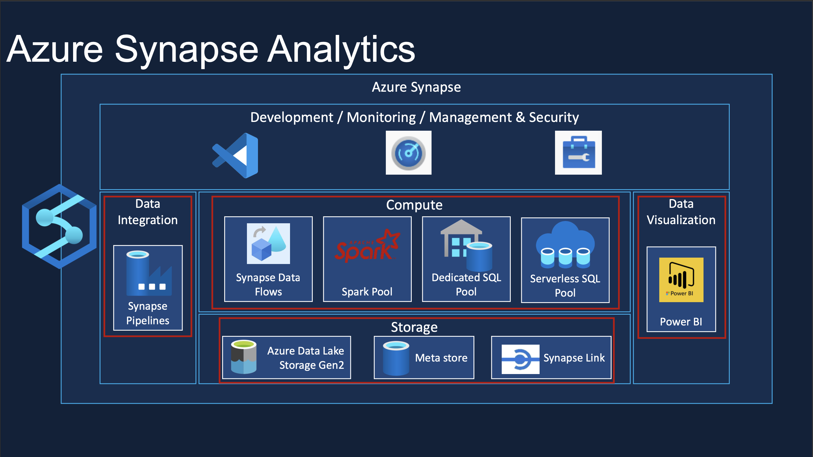
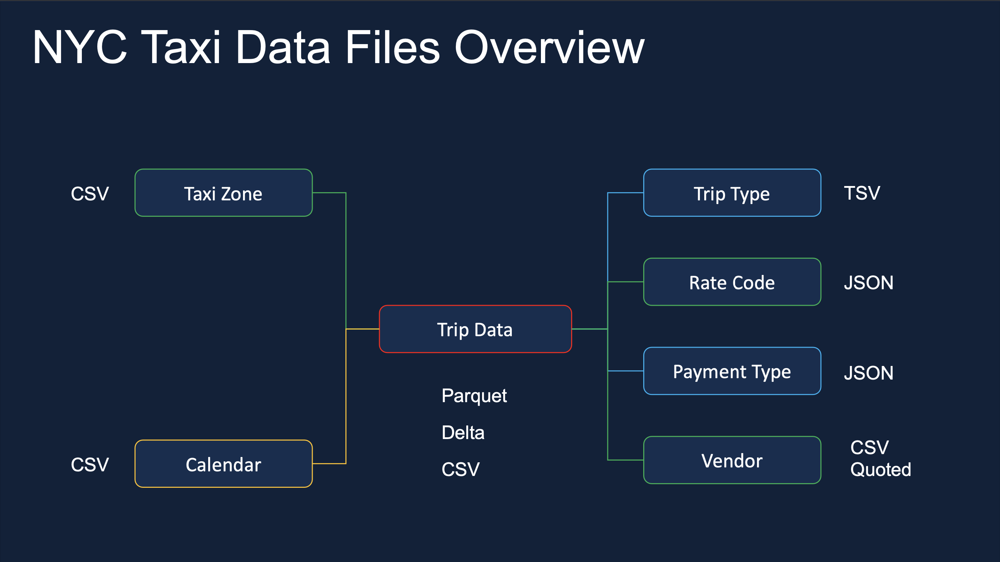
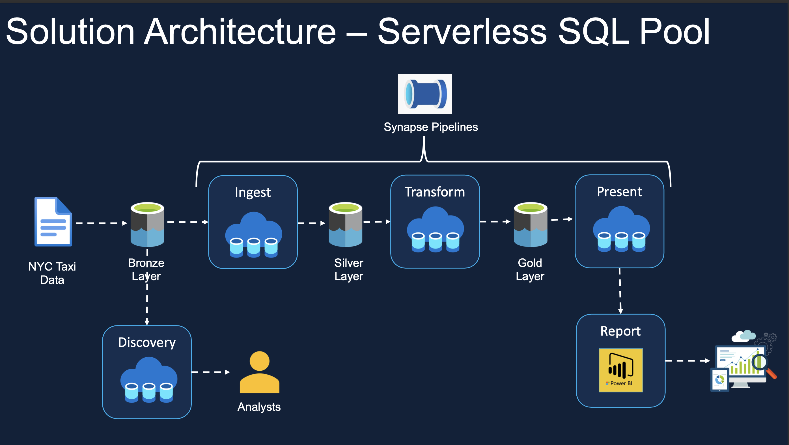
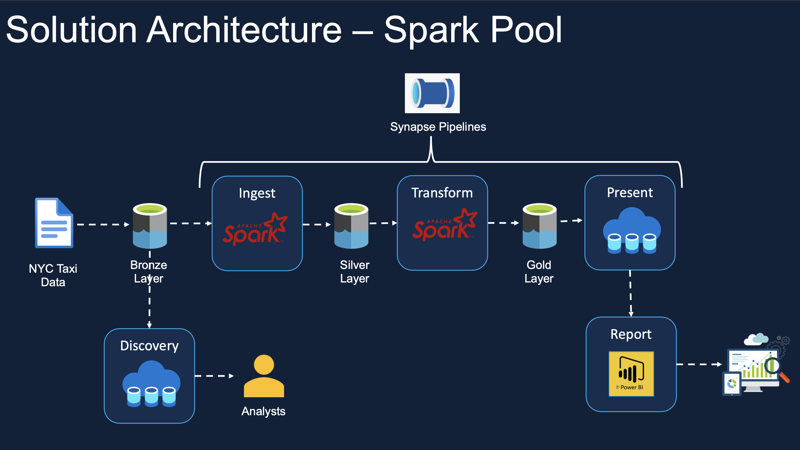
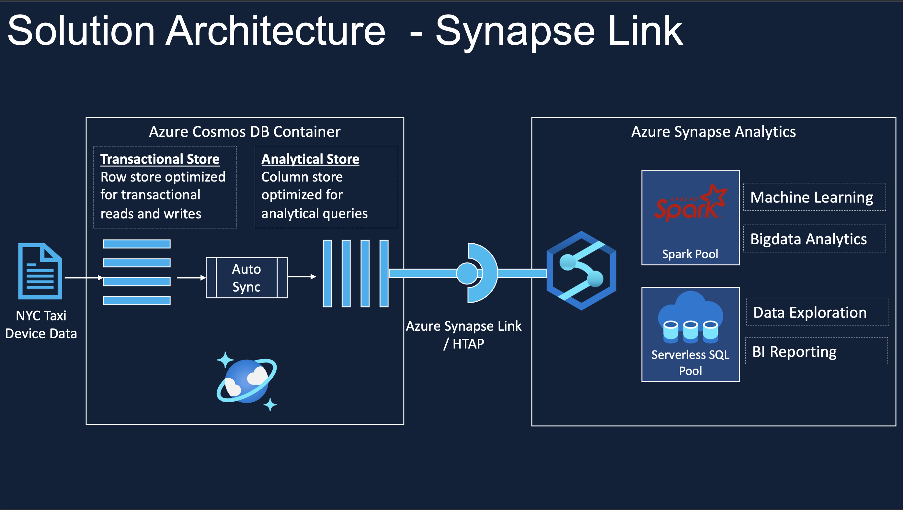
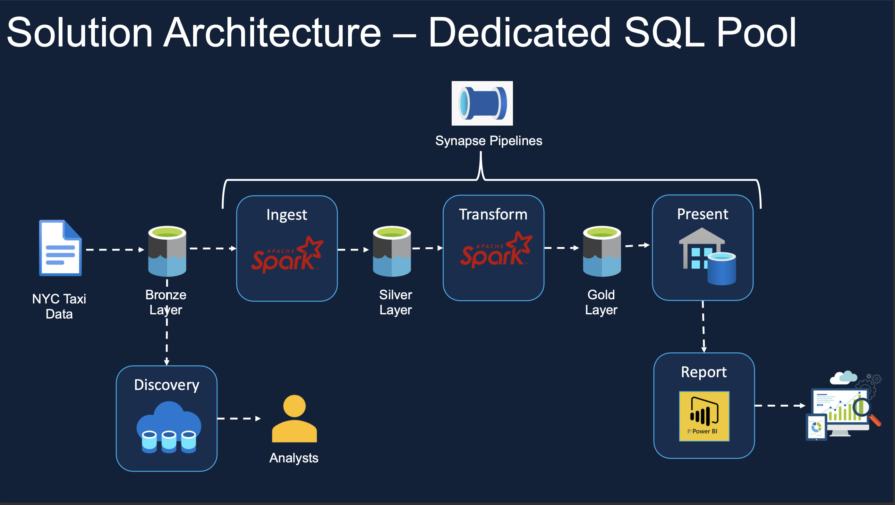
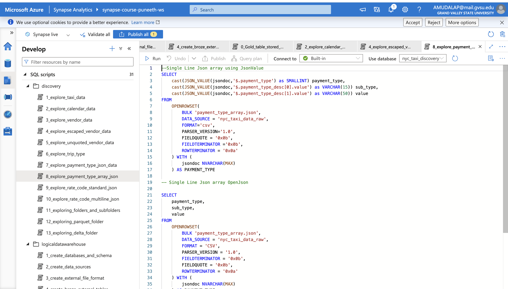
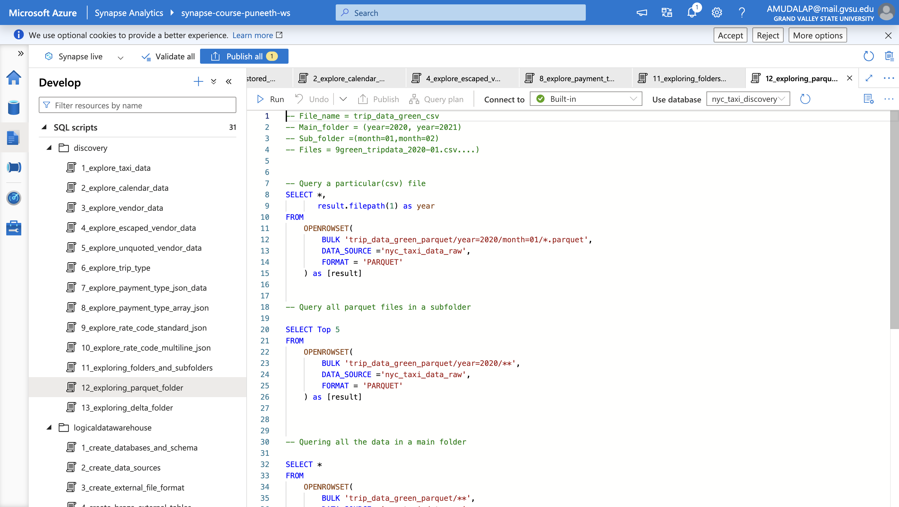
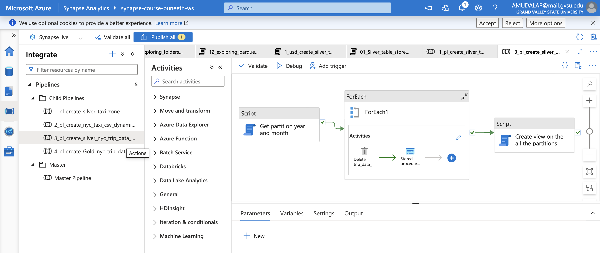
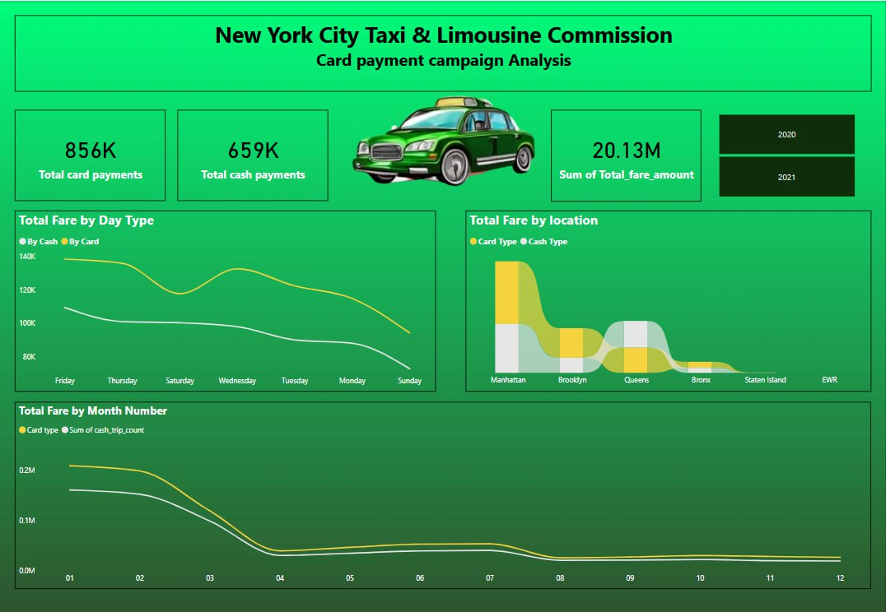

# 🚖 NYC Green Taxi Data Engineering Project - Real-World Data Transformation

## 🏆 Project Overview
This project is a **real-world data engineering implementation** using **Azure Synapse Analytics** to process and analyze NYC Green Taxi data. By leveraging **Serverless SQL Pools, Apache Spark, Synapse Pipelines, and Power BI**, we transform raw data into meaningful insights. This end-to-end pipeline enables optimized taxi demand forecasting, payment trend analysis, and cost-efficient data storage solutions.

🚀 **Key Achievements:**
- Designed and built a full-scale **data engineering project** with **Azure Synapse Analytics**.
- Automated **data ingestion, transformation, and orchestration** using Synapse Pipelines.
- Created **interactive Power BI dashboards** to visualize payment trends and taxi demand.
- Ensured **cost-effective, pay-per-query architecture** using **Serverless SQL Pools**.

---

## 🎯 Skills Demonstrated
✅ **Azure Synapse Analytics Architecture** (Serverless SQL, Dedicated SQL, Spark Pools)  
✅ **Data Engineering**: End-to-end data pipeline automation with Synapse Pipelines  
✅ **Big Data Processing**: Using **Spark Notebooks & T-SQL** for transformation  
✅ **Hybrid Transactional and Analytical Processing (HTAP)** with Synapse Link for Cosmos DB  
✅ **Power BI Integration**: Serving analytics-ready data for reporting  
✅ **Azure Data Lake Storage Gen2 Integration** for scalable storage  

---

## 🔎 The Challenge
NYC’s **Green Taxi** fleet generates vast amounts of trip data daily. However, raw data alone doesn’t drive business decisions. Companies need **real-time insights** into passenger demand, fare trends, and route optimization. This project builds an **automated and scalable data pipeline** to transform this data into actionable insights.

---

## 📌 Project Breakdown
### 🔍 **Data Discovery**

✅ Data exploration using **pay-per-query model**  
✅ Structured schema applied to raw data for efficient querying  
✅ T-SQL-based data discovery  

### 📥 **Data Ingestion**
✅ Data stored in **Parquet format** for optimized performance  
✅ Supports **pay-per-query ingestion** and SQL-based querying  
✅ Data stored as **tables and views** for structured analysis  

### 🔄 **Data Transformation**
✅ Joins applied to consolidate reporting tables  
✅ Transformed data stored in **columnar format (Parquet)**  
✅ SQL and Spark-based analytics-ready datasets  

### 📊 **Reporting & Insights**
✅ **Green Taxi Demand Analysis**: Identifies peak times and locations  
✅ **Credit Card Payment Insights**: Promotes cashless transactions  

### ⏳ **Pipeline Automation & Monitoring**
✅ Scheduled execution for real-time updates  
✅ Failure alerts and re-run capabilities for resilience  

---

## ⚙️ Tools & Technologies Used
🛢 **Azure Data Lake Storage Gen2 (ADLS)**  
📡 **Azure Synapse Analytics**  
🔄 **Synapse Pipelines**  
🔥 **Apache Spark Pool in Azure Synapse**  
🗄 **Azure SQL Serverless & Dedicated SQL Pools**  
📊 **Power BI**  
🌍 **Synapse Link for Cosmos DB**  

---

## 📂 NYC Green Taxi Data Breakdown

Sourced from [NYC Taxi & Limousine Commission (TLC)](https://www.nyc.gov/site/tlc/about/tlc-trip-record-data.page), the dataset includes:  
🚖 Pickup & drop-off locations  
📅 Timestamps & trip duration  
💰 Fare amounts & payment methods  
🌍 Borough & zone mapping  

### **File Types Used**
| Data Type     | File Type  |
|--------------|-----------|
| Trip Data    | CSV       |
| Taxi Zone    | CSV       |
| Calendar     | CSV       |
| Trip Type    | TSV       |
| Rate Code    | JSON      |
| Payment Type | JSON      |
| Vendor       | CSV       |

---

## 🏗 Solution Architecture
🔹 **Raw Layer**: Data ingested into **Azure Data Lake Storage (ADLS)**.  
🔹 **Bronze Schema**: External tables created via **OPENROWSET**.  
🔹 **Silver Schema**: Transformed into **Parquet**, partitioned, and optimized.  
🔹 **Gold Schema**: Business logic applied, and final data prepared for reporting.  
🔹 **Power BI**: Visual insights generated for business decisions.  

---

## 🛤 End-to-End Data Pipeline

### **Step 1: Raw Data Ingestion**

📌 Data from various formats (**CSV, JSON, TSV**) loaded into ADLS.

### **Step 2: Bronze Schema Creation**

📌 **OPENROWSET** used to define external tables.  
📌 Raw data remains in ADLS but is structured for querying.

### **Step 3: Silver Schema - Transformation & Partitioning**

📌 Data converted into **Parquet format** for faster access.  
📌 Partitioning applied for better performance.  
📌 **6 external tables & 1 view** created.  

### **Step 4: Gold Schema - Business Logic & Aggregation**

📌 Payment methods & green taxi demand analyzed.  
📌 Partitioning used to optimize reporting.  
📌 **Final views & partitioned tables** created.  

### **Step 5: Automated Pipeline Execution**

🚀 **Master Pipeline** automates all processes.  
📅 **Trigger**: Schedules the pipeline for real-time updates.  

---

## 📈 Power BI Reports - Transforming Data into Action
###  Payment Insights Report 💳

💡 Trends in cash vs. credit transactions.  
💡 Strategies to boost **credit card adoption.**  

---

## 🤝 Get Involved!
🚀 **Fork this repo** and contribute! Submit issues, suggest improvements, or collaborate.  

---

📌 **Transforming Data. Driving Insights. Powering Decisions.** 🚖💡

